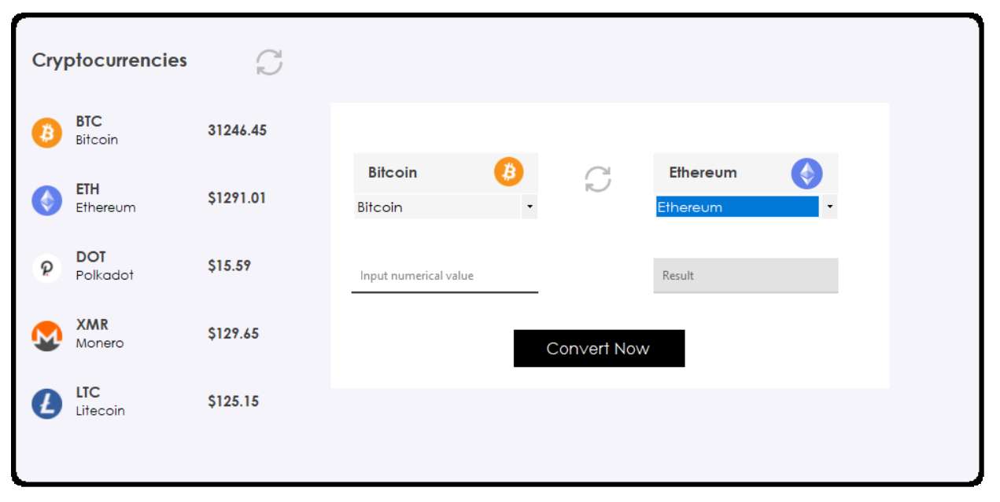
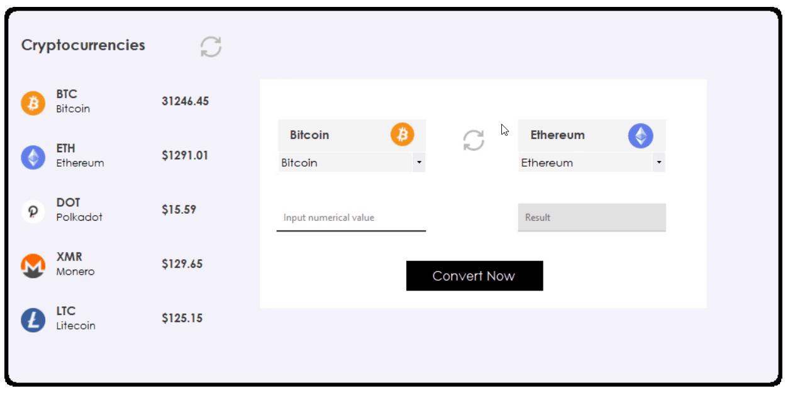

# Crypto Converter
## Description
The WinForms application, build on .NET Framework (also, Guna Framework was used) to convert some cryptocurrencies:
* BTC 
* ETH 
* DOT 
* XMR 
* LTC 

You can find info about these cryptocurrencies [**here**](https://coinpaprika.com).

## Demo
### How it looks

### How it works
